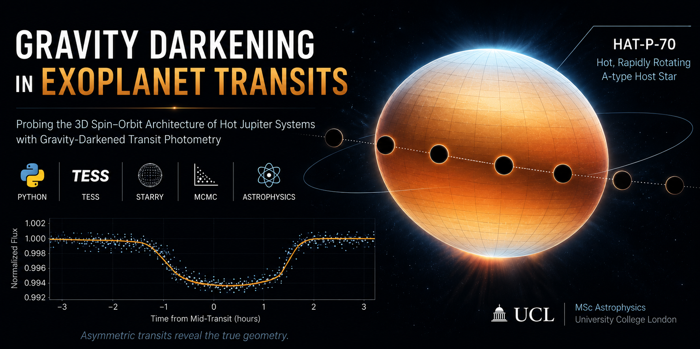

  

# Gravity Darkening in Exoplanet Transits

A Python-based Astrophysics research project investigating how gravity-darkened transit photometry can be used to constrain the true three-dimensional spin–orbit geometry of the hot Jupiter system **HAT-P-70.**

This repository contains the code, analysis, and results developed during my MSc Astrophysics research project at University College London (UCL).

The project combines real TESS observations, statistical inference, and gravity-darkened transit modelling to investigate the orbital architecture of rapidly rotating exoplanet systems.

## Technical Skills

- Python programming
- Scientific data analysis
- Statistical modelling
- Bayesian parameter estimation (MCMC)
- Time-series analysis
- Data visualisation
- Model fitting and optimisation
- Scientific computing
- Research communication

## Technologies

- Python
- NumPy
- SciPy
- Matplotlib
- Lightkurve
- STARRY
- Jupyter Notebook
- TESS Space Telescope Data

## Why this project?

Although this research was conducted in Astrophysics, the analytical workflow is broadly applicable to data science. The project involved working with real observational data, developing reproducible Python workflows, performing statistical inference, validating competing models, and communicating results through scientific visualisation and technical documentation.

Many of these skills are directly transferable to data analysis, scientific computing, and machine learning roles.

## Project Status

**MSc project completed**

Repository currently being reorganised and documented for public release.

Additional documentation, cleaned notebooks and reproducibility notes will be added over time.

## Reproducibility

This project was developed as part of my MSc Astrophysics research at University College London (UCL).

While most of the analysis and data processing notebooks can be reproduced using standard Python packages, the gravity-darkened transit modelling relies on the **STARRY** package and a software environment available on the University College London Observatory (UCLO) machines.

The version of **STARRY** used during this project is no longer straightforward to install on modern Python environments due to dependency compatibility. As a result, some notebooks—particularly those involving the STARRY simulations and MCMC analysis—may not execute without recreating the original software environment.

These notebooks are included to document the complete scientific workflow and methodology used throughout this research project. They are intended to provide transparency, reproducibility of the scientific approach, and insight into the implementation of the gravity-darkened transit modelling pipeline.

## Methodology

### 1. TESS Light Curve Preprocessing

The first stage of the project focuses on preparing high-quality TESS photometric observations for gravity-darkened transit modelling.

This notebook:

- Searches and downloads all publicly available TESS observations of HAT-P-70.
- Inspects the quality of each observing sector.
- Removes poor-quality measurements using the TESS quality flags.
- Stitches observations from multiple sectors into a single light curve.
- Detrends the light curve using the **Lightkurve** package.
- Folds and bins the transit signal.
- Exports clean datasets for the subsequent modelling and parameter estimation.

> **Note:** At the time this analysis was performed, TESS Sector 98 had not yet been released. The preprocessing therefore uses all publicly available observations available during the MSc project.

**Notebook:** [`01_tess_lightcurve_preprocessing.ipynb`](Notebooks/01_tess_lightcurve_preprocessing.ipynb)

### 2. Transit Light Curve Fitting

This notebook implements an analytical transit model based on the formulation presented by Haswell (*Exoplanet Transits*), incorporating quadratic limb darkening.

The workflow:

- Defines an analytical transit light curve model.
- Applies quadratic limb-darkening coefficients.
- Imports the preprocessed TESS light curve.
- Fits the analytical model to the observations.
- Optimises the transit parameters.
- Produces the best-fitting reference model used in the subsequent gravity-darkened analysis.

**Notebook:** [`02_transit_model_fitting.ipynb`](Notebooks/02_transit_model_fitting.ipynb)

### 3. Stellar Oblateness

This notebook derives the stellar parameters required for gravity-darkened transit modelling.

The workflow:

- Defines the stellar physical parameters.
- Computes the allowable stellar inclination range.
- Calculates the stellar rotation rate and oblateness.
- Investigates how the stellar shape varies with inclination.
- Estimates the polar and equatorial temperatures using gravity-darkening relations.
- Provides the stellar parameters used as inputs for the STARRY transit simulations.

**Notebook:** [`03_stellar_oblateness.ipynb`](Notebooks/03_stellar_oblateness.ipynb)

### 4. Gravity-Darkened Transit Modelling

This notebook implements the gravity-darkened transit model using the **STARRY** package to simulate transit light curves for HAT-P-70. The simulations investigate how stellar rotation, oblateness, gravity darkening, and spin–orbit geometry influence the observed transit profile.

The workflow:

- Imports the **STARRY** gravity-darkened transit modelling framework.
- Defines the stellar and planetary system parameters.
- Generates synthetic gravity-darkened transit light curves.
- Investigates the effects of stellar inclination, oblateness, and gravity darkening on the transit shape.
- Compares simulated models with the observed TESS light curve.
- Produces the gravity-darkened models used for the MCMC parameter estimation.

> **Compatibility Note:** This notebook was developed using the software environment available on the University College London Observatory (UCLO) machines. The version of **STARRY** used during this project is not directly compatible with many modern Python environments. Consequently, this notebook may require the original UCLO software environment, or equivalent package versions, to execute successfully.

**Notebook:** [`04_gravity_darkened_transit_modelling.ipynb`](Notebooks/04_gravity_darkened_transit_modelling.ipynb)

### 5. MCMC Simulation

This notebook prepares the Bayesian parameter estimation of the HAT-P-70 system using the gravity-darkened transit model developed with **STARRY**. It defines the model, the parameters, the prior distributions, and the likelihood function required for the Brewer MCMC sampler.

The workflow:

- Defines the stellar and planetary system parameters.
- Implements the gravity-darkened transit model within the Bayesian framework.
- Specifies the model parameters, priors, proposal function, and likelihood function.
- Configures the MCMC simulation and starting conditions.
- Exports the notebook as a Python script for execution on the UCLO computing environment.
- Generates individual MCMC trace files during the simulation.

The exported Python script was executed using the accompanying command-line launcher (`run_mcmc.cmd`) on the University College London Observatory (UCLO) machines. Approximately 400,000 MCMC samples were generated, with the first ~100,000 samples discarded as burn-in. The individual trace files were then concatenated into a single final dataset (`FINAL_30_12_25.csv`) for subsequent analysis.

> **Compatibility Note:** This notebook was developed using the software environment available on the University College London Observatory (UCLO) machines. It depends on the **STARRY** package and the Brewer MCMC implementation used during this research project. Reproducing the complete workflow may require recreating the original software environment.

**Notebook:** [`05_mcmc_cosine_parameterisation.ipynb`](Notebooks/05_mcmc_cosine_parameterisation.ipynb)

### 6. MCMC Analysis and Scientific Results

This notebook analyses the final MCMC chain produced by the simulation stage. It evaluates the posterior distributions, derives the best-fitting model parameters, and produces the scientific results presented in the dissertation.

The workflow:

- Loads the concatenated MCMC chain (`FINAL_30_12_25.csv`).
- Removes the burn-in samples from the Markov chain Monte Carlo.
- Computes the posterior distributions of the fitted parameters.
- Produces trace plots and corner plots to assess parameter convergence.
- Derives the best-fitting stellar and orbital parameters.
- Calculates derived quantities, including the true spin–orbit angle (ψ).
- Generates the figures and statistical results presented in the dissertation.

> **Compatibility Note:** This notebook analyses the final MCMC chain produced during the simulation stage. Although the notebook itself can be executed independently, reproducing the results requires the MCMC chain generated using the UCLO computational workflow.

**Notebook:** [`06_mcmc_parameter_estimation.ipynb`](Notebooks/06_mcmc_parameter_estimation.ipynb)

## License

The source code in this repository is licensed under the **MIT License** (see the `LICENSE` file).

The MSc dissertation, presentation, and all associated written material remain © 2026 Nicola Diurno. These documents are included to document the research project and are not covered by the MIT License.